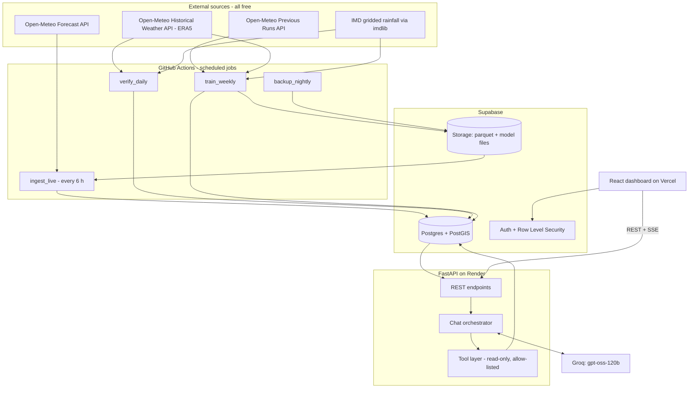

# AAGAM — Tech Stack & Build Environment
**AAGAM = Adaptive AI-Grid Assimilation Model** · SIH 2026 · PS 26081 (MoES / NCMRWF) — *Hybrid AI–NWP Multi-Model Forecast Blending System*

> Companion to `AAGAM_PRD.md`. This file answers **"what do we use, why, with which limits, and how do the pieces connect."** The PRD answers **"what do we build, in what order."**
>
> **Status legend used below**
> - ✅ = checked against the vendor's own public docs/pricing on **19 Sep 2026**
> - ⚠️ = comes from a secondary source, or is my inference — **re-check before you depend on it**
>
> Plain-language explanations of jargon are in (brackets) the first time a term appears.

---

## 1. Stack at a glance

| Layer | Choice | Free? | Why this one |
|---|---|---|---|
| Forecast data (live) | Open-Meteo Forecast API — GFS, ECMWF IFS 0.25°, DWD ICON, ECMWF AIFS | ✅ non-commercial, 10,000 calls/day, 300,000/month | One API, no key, 4 sources incl. a real AI model |
| Forecast data (history, per lead time) | Open-Meteo **Previous Runs API** | ✅ (free tier) | Gives past forecasts at fixed 1–7-day lead — required for lead-time weighting |
| Ground truth — rainfall | IMD gridded rainfall (0.25°) via `imdlib` | ✅ | India's own official rainfall product |
| Ground truth — temperature, wind | ERA5 via Open-Meteo Historical Weather API | ✅ | Hourly, global, easy to align |
| Data handling | pandas, numpy, xarray, pyarrow | ✅ open-source | Standard scientific-Python stack |
| Decision engine 1 | scikit-learn **Ridge** (positive weights) | ✅ | Explainable weights → powers the "weight maps" |
| Decision engine 2 | **LightGBM** | ✅ | Learns non-linear corrections; CPU-only, trains in minutes |
| Database | **Supabase** (Postgres + PostGIS, Auth, Storage) | ✅ 500 MB DB, 1 GB storage, pauses after 7 idle days | One free service gives DB + login + file storage |
| Backend API | **FastAPI** (Python) on **Render** free web service | ✅ 512 MB RAM, sleeps after 15 min idle | Same language as the ML code |
| LLM | **`openai/gpt-oss-120b` on Groq** (note: **Groq**, not xAI's "Grok") | ✅ free tier is small — see §8 | Very fast, open-weight, supports tool calling |
| Frontend | **React + TypeScript + Vite**, Tailwind CSS, shadcn/ui, Apache ECharts, react-leaflet | ✅ | Dense dashboard UI with map + heatmaps |
| Frontend hosting | Vercel Hobby (or Cloudflare Pages / Netlify) | ✅ non-commercial | Zero-config deploy from GitHub |
| UI quality tooling | **Impeccable**, **Taste-Skill**, **Emil Kowalski's skills** (AI-agent design skills) | ✅ Apache-2.0 / MIT | See §9 |
| Scheduler / CI | **GitHub Actions** cron | ✅ | Runs ingestion, blending, weekly retraining |

**Finalised forecast sources = 4** (3 physics + 1 AI): **GFS**, **ECMWF IFS**, **DWD ICON**, **ECMWF AIFS**. That directly matches the PS wording ("physical NWP models … AI/ML weather models").
**Finalised decision engines = 2** + a transparent baseline: Ridge, LightGBM, and inverse-error skill weights.

---

## 2. Architecture (one picture)



**How to read it.** Scheduled jobs (GitHub Actions) fetch data, compute blends, and write to Supabase. The dashboard never talks to the weather APIs or the LLM directly — it only talks to our FastAPI backend, which reads from Supabase and (for chat) calls Groq. **Heavy work (training) never runs on the web server**; Render's free tier has only 512 MB RAM. ⚠️ (Render figures per its 2026 free-tier docs/summaries.)

---

## 3. Data sources — exact facts and call budget

### 3.1 Open-Meteo (forecasts + ERA5 truth)
| Item | Fact |
|---|---|
| Free-tier caps ✅ | 600 calls/min, 5,000/hour, **10,000/day, 300,000/month**; **non-commercial only**; no uptime guarantee |
| Licence ✅ | Data CC BY 4.0 → **attribution required** (footer + README) |
| How calls are counted ✅ | Fractional. >10 variables **or** >2 weeks of data for one location counts as multiple calls (e.g. 2 weeks × 15 vars = 1.5 calls). Locations and models also multiply cost → **use the pricing-page calculator as the authority** |
| Previous Runs API ✅ | Variables like `temperature_2m_previous_day1 … _previous_day7` = "what the model predicted N×24 h before the valid time". Archived from **Jan 2024** for most models (GFS 2 m temperature from Mar 2021). Free tier includes it |
| Historical Forecast API ✅ | **Stitches only the first hours of each run** → it is *not* lead-time-specific. **Do not use it for lead-time weights.** |
| AIFS ✅ | ECMWF's AI model is served as `ecmwf_aifs025_single` (0.25°, 6-hourly, every 6 h) |
| Model strings ⚠️ | `gfs_seamless` (or `gfs_global`), `ecmwf_ifs025`, `icon_global`, `ecmwf_aifs025_single` — confirm exact spellings in the API docs' model list before hard-coding |
| Production note ✅ | Free API = non-commercial. If NCMRWF ever runs AAGAM operationally: buy a plan, self-host Open-Meteo (AGPL), or swap to NCMRWF's own feeds. Say this in the pitch. |

**Call-budget worked example (estimates — recheck with the calculator):**

| Job | Calculation | ≈ Calls |
|---|---|---|
| Live cycle (8-day forecast, 3 variables) | 40 locations × 4 models × ~1 | ~160 per cycle → **~640/day** |
| One-off history backfill (Jan 2024 → today) | ~1,000 days ÷ 14 ≈ 72 units × ~2.1 (21 lead-variables) × 160 (loc×model) | **~24,000 total** → spread over **3–4 days** |
| ERA5 truth backfill | 40 locations × ~72 units | ~3,000 |
| Weekly incremental refresh | last ~14 days only | a few hundred |

Throttle every job (`tenacity` retries + sleep) and stop at ~8,000 calls/day during backfill.

### 3.2 IMD (rainfall ground truth)
| Item | Fact |
|---|---|
| Rainfall product ✅ | Daily gridded, **0.25°**, built from ~6,955 stations (Pai et al.); temperature product is **1°** (too coarse to verify 0.25° models — use it only for climatological "normals") |
| Access ✅ | `imdlib` (MIT, downloads IMD `.grd` files into xarray; variables `rain`, `tmin`, `tmax`). `imddata` (tiny CLI, netCDF) also works; `imddaily` fetches near-real-time daily files |
| ⚠️ Lag | Final gridded data can trail real time. **Check the latest available date on day 1.** Plan: IMD for training/history; ERA5 fallback for the most recent verification window |
| ⚠️ Day boundary | IMD daily rainfall is normally 08:30 IST → 08:30 IST (= 03:00 UTC → 03:00 UTC). AAGAM must aggregate model rainfall over the **same window** (confirm with IMD docs) |

### 3.3 Thresholds for extreme-weather flags (IMD's own numbers)
| Hazard | Rule ✅ |
|---|---|
| Heavy rain (24 h) | 64.5–115.5 mm |
| Very heavy | 115.6–204.4 mm |
| Extremely heavy | ≥ 204.5 mm |
| Heat wave | Max temp ≥ 40 °C (plains) / ≥ 37 °C (coastal) / ≥ 30 °C (hills) **and** departure from normal 4.5–6.4 °C; severe if > 6.4 °C. Alternatively absolute ≥ 45 °C (heat wave) or ≥ 47 °C (severe). Official declaration needs the condition at ≥ 2 stations in a sub-division for 2 consecutive days |
| High wind | ⚠️ No single IMD number verified. Ship configurable defaults on the **Beaufort scale** (gale 62–74 km/h, strong gale 75–88, storm 89–102) and let forecasters change them in `config/thresholds.yaml` |

AAGAM issues **decision-support flags, not official warnings** — say so in the UI.

### 3.4 Locations & time conventions
- **40 representative points** (2–4 per region, incl. hill, coastal, plain). Store names in `config/locations.yaml` and get coordinates from Open-Meteo's free Geocoding API — do **not** hand-type coordinates.
- **Regions (project grouping):** North-West, Central, East & North-East, South Peninsula, Himalayan/Hilly.
- **Seasons (IMD):** Winter (Jan–Feb), Pre-monsoon (Mar–May), Southwest Monsoon (Jun–Sep), Post-monsoon (Oct–Dec).
- **Lead time:** 1–7 days (from `previous_dayN`), plus day 0.
- **Time zone:** store everything in **UTC**; *aggregate to IST days* (rain: 08:30 IST windows; Tmax/Tmin/wind-max: IST calendar day); display IST.

---

## 4. Models and decision engines

### 4.1 The four forecast sources
| Source | Type | Why included |
|---|---|---|
| GFS (NOAA) | Physics (NWP) | Global baseline, long history |
| ECMWF IFS 0.25° | Physics (NWP) | Generally the strongest global physics model |
| DWD ICON | Physics (NWP) | Independent second opinion |
| ECMWF AIFS | **AI / ML** | Represents the "AI/ML models" in the PS |

Optional stretch (not MVP): Open-Meteo **Ensemble API** (ECMWF/GEFS members) for spread-based confidence ✅ (free tier lists Ensemble API).

### 4.2 Decision engines (the "AI" part)
| Engine | What it does (plain) | Lib | Outputs used for |
|---|---|---|---|
| **Skill-weight baseline** | Trusts each model in proportion to how *little* it erred recently in that (region, season, lead) bucket | pandas | Baseline to beat; fills the **weight maps** |
| **Ridge (positive=True)** | Learns the best non-negative mix of the 4 models from history; a built-in penalty stops any weight going wild | scikit-learn | Explainable weights → weight maps, forecaster overrides |
| **LightGBM** | Learns corrections a straight mix can't (e.g. "ICON overshoots on coastal monsoon days") | lightgbm | Better rainfall/extreme skill; not interpretable as weights |

**Final blend rule (Layer 5):** per (variable, lead) use whichever of Ridge / LightGBM had lower validation error; if within ~2 %, average them. Baselines to report against: (a) equal-weight mean, (b) best single model per bucket.

### 4.3 Evaluation rules (non-negotiable)
1. **Time-based split only** — train on the past, validate on the next block, test on the latest ~3 months. Never random-shuffle weather data (leaks the future).
2. Metrics: MAE, RMSE, bias; **skill score = 1 − MAE_blend / MAE_reference**.
3. Rainfall is mostly zeros and heavy-tailed → also report **categorical scores (POD, FAR, CSI)** at IMD thresholds; consider `sqrt`/`log1p` targets.
4. Averaging *smooths peaks*. So extreme flags use **"how many models exceed the threshold" + max-of-models + spread**, not the blended mean alone.
5. Report honestly if the blend does not beat the best single model in some buckets. Judges trust that more than a perfect chart.

---

## 5. Python data/ML libraries
```
# pyproject.toml — dependency groups (use `uv sync` or pip)
[core]     pydantic>=2, pyyaml, python-dotenv, pytz/zoneinfo
[pipeline] httpx, tenacity, pandas, numpy, xarray, netcdf4, h5netcdf, pyarrow,
           scikit-learn, lightgbm, joblib, imdlib, typer, supabase (storage client),
           psycopg[binary]  (or asyncpg), shap (optional, explanations)
[api]      fastapi, uvicorn[standard], pydantic-settings, asyncpg, httpx, groq,
           slowapi (rate limiting), python-jose or supabase-jwt verification, orjson
[dev]      pytest, pytest-asyncio, ruff, mypy (optional), pre-commit
```
- **Python 3.12.** Manager: `uv` (fast, lockfile) — plain `pip` also fine.
- **CLI:** `typer` gives commands like `python -m pipeline ingest-live`, `train`, `verify`, `backfill --from 2024-01-01`.

---

## 6. Database & storage (Supabase)

### 6.1 Free-tier facts ✅
500 MB DB, 1 GB file storage (50 MB max file), 5 GB egress, 2 active projects, **no automatic backups**, **auto-pause after 7 idle days** (manual resume from dashboard). ⚠️ Direct DB hosts can be IPv6-only — from Render use the **connection pooler string**; with `asyncpg` on the transaction pooler set `statement_cache_size=0`.

### 6.2 What lives where (keeps us far below 500 MB)
| Where | What | Approx. size |
|---|---|---|
| Postgres | `locations`, current `model_forecasts` (latest run only, upsert), `blended_forecasts` (rolling 180 days, 00Z run only), `weights`, `skill_scores` (latest plus 26 weekly snapshots), `alerts`, `model_versions`, `pipeline_runs`, `profiles`, `weight_overrides`, `chat_audit` | ~ tens of MB |
| Storage bucket `training-data` | Parquet: joined (forecasts × truth) table, Jan 2024 → today (~830k rows for 40 loc × 7 leads × 3 vars × ~990 days) | ~ 30–60 MB |
| Storage bucket `models` | `models/{yyyymmdd}/ridge.joblib`, `lgbm_*.txt`, `metrics.json` | few MB per version |
| Storage bucket `backups` | Nightly Parquet export of key tables (free plan has no backups) | small |

> **Correction to the earlier report:** the "<100 MB" estimate assumed 3 models and no per-lead detail. The new numbers above are the ones to plan on.

### 6.3 Tables (summary — full SQL in PRD §11)
`locations(id, name, state, region, geom geography(Point))` · `model_forecasts(issue_time, valid_date, lead_days, location_id, model, variable, value)` · `blended_forecasts(… blended, ridge, lgbm, spread, n_models_exceed, confidence, version_id)` · `weights(version_id, region, season, lead_days, variable, model, weight, method)` · `skill_scores(…mae, rmse, bias, n, is_weekly)` · `alerts(…hazard, severity, threshold_rule, agreement, status)` · `model_versions(id, created_at, metrics jsonb, is_active)` · `weight_overrides(user_id, …, reason, expires_at)`.

### 6.4 Security
Row Level Security (RLS = per-row permission rules) on every table. **Service-role key only in GitHub Actions secrets and Render env — never in the browser.** Frontend uses the anon key + user JWT.

---

## 7. Backend API (FastAPI on Render)
- **Endpoints:** `/api/v1/forecast`, `/weights`, `/skill`, `/alerts`, `/history`, `/export`, `/chat` (SSE stream), `/health`.
- **Auth:** verify Supabase JWT on each request; roles `viewer`, `forecaster`, `admin` from `profiles.role`.
- **Rate limits:** `slowapi` per user/IP; chat has its own tighter limit.
- **Render free tier ⚠️:** sleeps after ~15 min idle, cold start ~30–60 s, 750 free hours/month per workspace. Mitigation: call `/health` when the dashboard loads and show a "waking up the server" state; before demo day, ping it 5 minutes ahead. Do **not** run a permanent keep-alive cron (it burns the 750 h).
- **No ML training on Render.** It only loads the *active* model file from Supabase Storage if it needs to re-blend on demand (rare; normally blends are precomputed).

---

## 8. LLM layer — Groq `openai/gpt-oss-120b`

### 8.1 Facts
| Item | Value |
|---|---|
| Model ID ✅ | `openai/gpt-oss-120b` (open-weight MoE, 120B total / 5.1B active per token) |
| Context ✅ | 131,072 tokens; supports function/tool calling and adjustable reasoning effort (low/medium/high) |
| Endpoint ✅ | OpenAI-compatible: `https://api.groq.com/openai/v1` · official `groq` Python SDK |
| Price (Developer plan) ✅ | ≈ $0.15 / 1M input tokens, $0.60 / 1M output tokens; higher limits (≈ 250K TPM, 1K RPM) |
| **Free-tier limits ⚠️** | Measured by a third party on 14 Sep 2026: **30 req/min, 1,000 req/day, 8,000 tokens/min, 200,000 tokens/day**, per *organisation*. Confirm on your own console "Limits" page |
| 429 handling ✅ | Responses carry `retry-after` and `x-ratelimit-remaining-tokens` headers |

### 8.2 The design consequence: **8,000 tokens/min is tiny**
So the chat is engineered around a token budget:
- System prompt ≤ ~600 tokens · tool schemas ≤ ~900 · last turns ≤ ~500 · **each tool result ≤ ~700 tokens**.
- `reasoning_effort="low"` (reasoning tokens count as output — assume so ⚠️).
- ≤ 3 model calls per user question.
- **Raw data never flows through the LLM.** For "give me raw data", the backend runs the tool, stores the full result server-side under an `artifact_id`, sends the table straight to the browser as a separate stream event, and the LLM only writes a one-line caption. This gives *exact* numbers and saves tokens.
- Cache identical questions (hash of normalised question + data-version) for ~10 min.
- Global in-process token-bucket limiter; **fallback to `openai/gpt-oss-20b`** on 429 (limits are per model ⚠️).
- **Demo day:** switch the Groq org to the Developer plan (pay-per-token, pennies for a demo).

### 8.3 Tools the LLM may call (no free-form SQL — safer and cheaper)
`get_forecast` · `get_weights` · `get_skill` · `get_alerts` · `query_history` · `export_data`. All read-only, parameter-validated with Pydantic, resolved server-side (location names → ids). Details in PRD §9.

### 8.4 Guardrails
Numbers in the answer must come from tool results (post-check flags unmatched numbers) · tool output is *data, never instructions* (prompt-injection defence) · every call logged to `chat_audit` · answers carry a "decision-support, not an official IMD warning" line where relevant.

---

## 9. Frontend stack and the three UI-quality skill packs

### 9.1 Libraries
| Need | Choice |
|---|---|
| App shell | React + TypeScript + Vite; React Router |
| Styling / components | Tailwind CSS + **shadcn/ui** (Radix primitives); icons: `lucide-react` |
| Data fetching / state | TanStack Query (server state), Zustand (tiny UI state) |
| Charts & heatmaps | **Apache ECharts** (`echarts-for-react`) — one library covers line + confidence band, bar, and the **weight-map heatmap** |
| Map | **Leaflet + react-leaflet**; dark basemap tiles (CARTO "dark" with attribution ⚠️ check tile usage terms; OSM tiles only for light traffic) |
| Toasts | **Sonner** (also the toast shadcn uses) |
| Motion | CSS transitions first; **Motion** (formerly Framer Motion) only for enter/exit/layout animation |
| Markdown in chat | `react-markdown` |
| Auth | `@supabase/supabase-js` |
| Validation | `zod` |
| Fonts | Self-host via `@fontsource` (no runtime Google Fonts call). Starting proposal: **IBM Plex Sans + IBM Plex Mono** (tabular numerals for data) — final choice made through the design skills below |
| ⚠️ India map boundary | Use a GeoJSON that matches **Survey of India / official** boundaries (J&K, Ladakh, Arunachal). Default open datasets often draw India differently — verify visually before any demo to officials |

### 9.2 The three skill packs you asked to use (all read from their GitHub READMEs on 19 Sep 2026)
These are **instruction files for AI coding agents** (Claude Code, Cursor, Codex, Copilot, Gemini CLI, etc.). They do nothing unless you build the frontend *through* such an agent.

| Pack | Install | What it gives us | When to use it in AAGAM |
|---|---|---|---|
| **Impeccable** (Apache-2.0) | `npx impeccable install` then `/impeccable init` | 1 skill, 24 commands (`shape`, `craft`, `critique`, `audit`, `polish`, `harden`, `adapt`, `animate`, `typeset`, `layout`, `clarify`, `optimize`…), **61 deterministic anti-pattern detector rules** (CLI, no LLM/API key needed). `init` writes **`PRODUCT.md`**; `document` writes **`DESIGN.md`** | **Backbone.** `init` once → `shape` each page → `craft` → then `critique` → `audit` → `polish` → `harden`. Run `npx impeccable detect src/` locally and in CI |
| **Taste-Skill** (MIT) | `npx skills add https://github.com/Leonxlnx/taste-skill --skill "design-taste-frontend"` | Anti-"AI-slop" rules with three 1–10 **dials**: `DESIGN_VARIANCE`, `MOTION_INTENSITY`, `VISUAL_DENSITY`. Default skill is **v2 (experimental)**; a v1 is kept as `design-taste-frontend-v1`. Extras: `redesign-existing-projects`, `minimalist-ui`, `full-output-enforcement` | **Generation-time guidance.** Dashboard dials: **VARIANCE 3–4** (predictable, scannable layout), **MOTION 3** (subtle), **VISUAL_DENSITY 8** (dense dashboard). Add `full-output-enforcement` if the agent truncates files |
| **Emil Kowalski skills** (MIT) | `npx skills@latest add emilkowalski/skills` | `emil-design-eng` (animation + design craft), `animate`, `review-animations`, `improve-animations`, `find-animation-opportunities`, `animation-vocabulary`, `pick-ui-library`, `prototype`, `mobile-native`, `ask-sonner` | **Motion & polish.** Use `animate`/`review-animations` for chart transitions, panel open/close, alert arrival; `pick-ui-library` before adding any new dependency; `ask-sonner` for toasts; `mobile-native` if we ship a phone layout |

**Precedence when advice conflicts:** (1) `PRD` + `PRODUCT.md` (our purpose and audience) → (2) Impeccable (design language, critique/audit verdicts) → (3) Taste-Skill (defaults + dials) → (4) Emil (motion details). Don't enable every variant at once — extra overlapping skills add noise.

**Security notes:** Impeccable installs an editor **hook** that can download a pinned engine binary on first run — read `npx impeccable install` prompts and the repo's hook docs before approving it (esp. on shared machines). Add Impeccable's `.gitignore` block (from its README) so screenshots/caches aren't committed; **do** commit `PRODUCT.md`, `DESIGN.md`, `.impeccable/config.json`, `.impeccable/design.json`.

### 9.3 UI reference — the Dribbble "Stakent – Crypto Dashboard" shot
That page is JavaScript-rendered and I **could not read or see the design**. So nothing in these docs claims to reproduce its exact look. Do this instead: save a **screenshot into `docs/design-ref/`**, then tell the agent (`/impeccable shape`, or Taste-Skill's image-first flow) to use it as *layout/mood reference only* — dark surface, sidebar navigation, modular card grid, KPI tiles up top. Adapt it to weather data; don't copy crypto-specific patterns (tickers, buy/sell). PRD §10 defines the AAGAM-specific screens.

---

## 10. Scheduling & CI (GitHub Actions)
| Workflow | Cron (UTC) | Job |
|---|---|---|
| `ingest-blend.yml` | `17 0,6,12,18 * * *` | Fetch latest forecasts → aggregate → blend with active model → flag extremes → write DB. (Global models run at 00/06/12/18 UTC and are available ~4–6 h later, hence the offsets ✅) |
| `verify-daily.yml` | `23 3 * * *` | Pull truth for dates that are now verifiable → update `skill_scores` |
| `train-weekly.yml` | `47 2 * * 0` | Append latest week → retrain Ridge + LightGBM → evaluate → register new `model_versions` → activate only if not worse |
| `backup-nightly.yml` | `41 3 * * *` | Export key tables to Parquet in Storage |
| `ci.yml` | on push/PR | ruff + pytest + frontend build + `npx impeccable detect` (optional) |

Notes: unlimited minutes on public repos, 2,000/month on private (per earlier research ✅ — re-check). Scheduled runs are best-effort and can start minutes late; avoid the top of the hour (as above). ⚠️ GitHub disables scheduled workflows in *public* repos after ~60 days without repo activity — push a commit or re-enable before demo. The 6-hourly DB writes also keep the Supabase project from auto-pausing.

---

## 11. Hosting & cost summary
| Item | Plan | Cost |
|---|---|---|
| Supabase | Free | ₹0 |
| Render (API) | Free web service | ₹0 |
| Vercel/Cloudflare (web) | Free / Hobby | ₹0 |
| GitHub Actions | Free | ₹0 |
| Open-Meteo | Free (non-commercial) | ₹0 |
| Groq | Free for build; **Developer plan on demo days** | pennies |
| Domain (optional) | — | optional |

---

## 12. Repository layout
```
aagam/
├─ web/                     # React app (Vite)
│  ├─ src/{app,pages,components,features,lib,styles}
│  └─ public/
├─ api/                     # FastAPI
│  ├─ app/{main.py,routers,services,tools,llm,auth,db}
│  └─ tests/
├─ pipeline/                # jobs run by GitHub Actions
│  ├─ ingest/{openmeteo.py,previous_runs.py,imd.py,era5.py}
│  ├─ transform/{aggregate.py,align.py}
│  ├─ skill/{score.py,weights.py}
│  ├─ models/{ridge.py,lgbm.py,select.py,registry.py}
│  ├─ blend/{blend.py,extremes.py}
│  └─ cli.py
├─ core/                    # shared: config loader, thresholds, schemas
├─ config/{locations.yaml,regions.yaml,thresholds.yaml,models.yaml}
├─ supabase/migrations/     # SQL, versioned
├─ docs/{PRD.md,TECH_STACK.md,design-ref/}
├─ .github/workflows/
├─ PRODUCT.md  DESIGN.md    # Impeccable
└─ .impeccable/             # shared config only (see §9.2)
```

---

## 13. Environment variables
| Var | Used by | Secret? |
|---|---|---|
| `SUPABASE_URL`, `SUPABASE_ANON_KEY` | web, api | public-safe |
| `SUPABASE_SERVICE_ROLE_KEY` | pipeline (GitHub secret), api (Render env) | **SECRET — never in browser** |
| `DATABASE_URL` (pooler string) | pipeline, api | secret |
| `GROQ_API_KEY` | api only | secret |
| `GROQ_MODEL=openai/gpt-oss-120b`, `GROQ_FALLBACK_MODEL=openai/gpt-oss-20b` | api | no |
| `OPENMETEO_BASE_*` | pipeline | no |
| `APP_TZ_DISPLAY=Asia/Kolkata` | web, api | no |

`.env.example` committed; real `.env` git-ignored.

---

## 14. Free-tier risk register
| Risk | Effect | Mitigation |
|---|---|---|
| Open-Meteo daily/monthly cap | 429 errors, missing cycle | Budget in §3.1; throttle; log call estimates per job |
| Groq 8,000 TPM (free) | Chat stalls | Token budget §8.2; cache; fallback model; Developer plan for demos |
| Render cold start | 30–60 s first load | Warm-up ping + friendly loading state |
| Supabase pause / no backups | Site down after idle week; data loss | 6-hourly writes; nightly Parquet backup; check before demo |
| IMD data lag / missing values | Truth unavailable for recent days | ERA5 fallback; explicit `NaN` handling; never silently fill |
| GitHub cron delay/disable | Stale forecasts | "Last updated" stamp in UI; stale-data banner if > 9 h old |
| Model drift after weekly retrain | Worse skill | Registry + rollback flag; activate only if validation not worse |
| India boundary on map | Credibility | Verified official GeoJSON |

---

## 15. "Verify before you build" checklist (30 minutes, day 1)
- [ ] Open-Meteo calculator: cost of one live cycle and one backfill chunk
- [ ] Exact model strings and that `precipitation_previous_day1..7` exist for **all four** models (AIFS coverage in Previous Runs ⚠️)
- [ ] `imdlib`: latest available date for rainfall; confirm the 08:30 IST accumulation convention
- [ ] Groq console → Limits page for `openai/gpt-oss-120b` and `-20b`
- [ ] Supabase: enable PostGIS; test pooler connection from your machine and from Render
- [ ] Render: deploy a hello-world FastAPI and time a cold start
- [ ] India GeoJSON reviewed
- [ ] Impeccable / Taste / Emil skills installed in the coding agent you'll actually use

---

## 16. What changed versus the earlier report (be transparent with teammates)
| Earlier report | Now | Why |
|---|---|---|
| Use Open-Meteo **Historical Forecast** API for training | Use **Previous Runs API** | Historical Forecast stitches short-lead data, so it can't teach lead-time weights |
| 3 models (GFS, IFS, ICON) | **4** — add **AIFS** | Puts a genuine AI model in the blend, matching the PS |
| "10,000 calls/day" as the only cap | Also **300,000/month** and fractional call counting | Found on Open-Meteo's pricing page |
| `imddata` as IMD library | `imdlib` primary (`imddata` fallback) | More mature, documented xarray workflow |
| DB "<100 MB" | Postgres for serving only; history as Parquet in Storage | Per-lead training table is larger than first assumed |
| LLM = Gemini/Ollama idea | **Groq `gpt-oss-120b`** (your decision), built around free-tier token limits | Free TPM cap drives the chat architecture |
