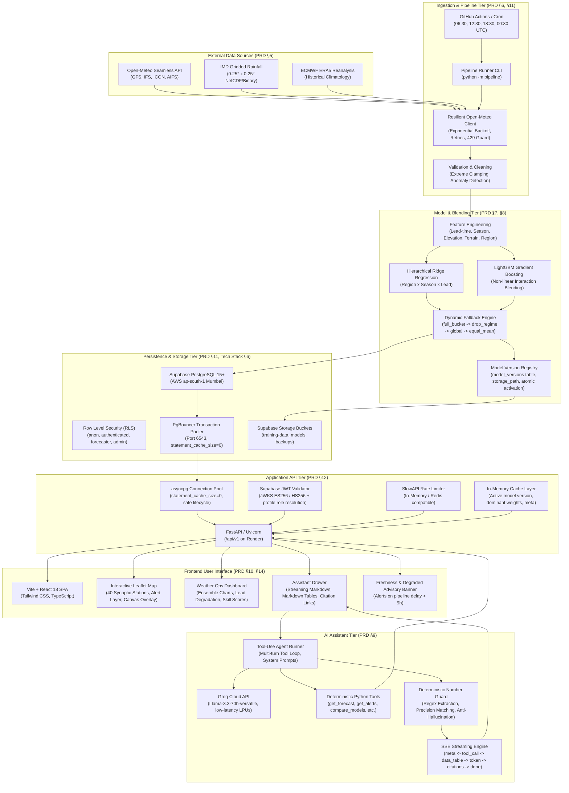

# AAGAM — Technical Architecture Specification

**Project:** Adaptive AI-Grid Assimilation Model (AAGAM)  
**Hackathon / Problem Statement:** Smart India Hackathon 2026 — PS 26081 (MoES / NCMRWF)  
**Classification:** Technical Architecture Document (PRD §4, §5, §6, §7, §8, §9, §11, §12)  
**Current Phase:** Phase 9 Hardening & Demo Readiness  

---

## 1. Executive Architecture Overview

AAGAM is a high-performance, real-time meteorological post-processing and AI assimilation platform designed to bridge global Numerical Weather Prediction (NWP) models, AI-driven forecast systems, and localized observational networks across India.

Unlike traditional single-model forecasting or static ensemble averages, AAGAM dynamically computes geographically and seasonally conditioned weights across four heterogeneous forecast engines:
1. **ECMWF IFS** (0.25° European Centre for Medium-Range Weather Forecasts)
2. **NOAA GFS** (0.25° Global Forecast System)
3. **DWD ICON** (0.25° Deutscher Wetterdienst Global Model)
4. **ECMWF AIFS** (Artificial Intelligence Forecasting System)

The resulting blended forecast delivers demonstrably lower Mean Absolute Error (MAE) and Root Mean Square Error (RMSE) across 1–7 day lead times, accompanied by an ensemble spread metric, rule-based extreme weather alert generation, and a fully verifiable AI reasoning assistant powered by Groq and Llama 3.3.

---

## 2. End-to-End System Architecture



---

## 3. Component Deep Dive

### 3.1 Data Ingestion & Normalization Tier
- **Open-Meteo Integration:** Polls 4 global NWP/AI runs at 40 synoptic stations across India. Ingests precipitation (`rain_mm`), maximum temperature (`tmax_c`), and wind speed (`wind_max_kmh`).
- **Resilience Engine:** Employs exponential backoff with jitter on HTTP 429 / 5xx responses. Implements client-side request chunking (max 10 stations per batch) to respect Open-Meteo's burst rate limits.
- **Data Validation & Clamping:** All incoming numerical values are clamped against physical meteorological bounds (e.g., rainfall $\ge 0$ mm, $T_{\text{max}} \in [-10^\circ\text{C}, 55^\circ\text{C}]$, wind speed $\ge 0$ km/h). Extreme outliers trigger an anomaly flag in `pipeline_runs`.

### 3.2 Database & Storage Tier
- **Engine:** PostgreSQL 15 hosted on Supabase (AWS Mumbai `ap-south-1`).
- **Connection Pooling:** Connected via Supabase PgBouncer Transaction Pooler on port `6543`. Critical configuration: `statement_cache_size=0` is enforced across all `asyncpg` pools to prevent prepared statement collisions inherent to transaction pooling.
- **Row Level Security (RLS):** Fully enabled across all tables:
  - `anon`: Read-only access to public endpoints (`/forecast`, `/alerts`, `/meta`, `/map`).
  - `authenticated`: Verified users with session tracking.
  - `forecaster`: Access to manual weight overrides and draft advisory publishing.
  - `admin`: Exclusive permissions for model version activation/rollback (`POST /api/v1/models/{id}/activate`) and storage bucket administration.
- **Object Storage:** Three private Supabase Storage buckets:
  - `training-data`: Historical NetCDF, CSV, and Parquet archives for model re-training.
  - `models`: Serialized scikit-learn Ridge and LightGBM model artifacts.
  - `backups`: Nightly Parquet exports of operational tables (`model_forecasts`, `blended_forecasts`, `alerts`, `skill_scores`, `weights`, `pipeline_runs`).

### 3.3 Model & Blending Tier
- **Stacking Hierarchy:**
  - Base level: GFS, ECMWF IFS, ICON, AIFS point forecasts.
  - Intermediate level: Feature transformation conditioned on Lead Time (1–7 days), Geographic Region (North, Northwest, Central, South, East, Northeast, Islands), Climate Season (Winter, Pre-monsoon, Monsoon, Post-monsoon), and Elevation.
  - Blending level: Ridge Regression minimizes MSE under L2 regularization; LightGBM captures non-linear boundary thresholds (e.g. convective rainfall triggers).
- **Graceful Degradation (Fallback Hierarchy):**
  If fewer than 4 base models are available or historical sample count $N < 30$:
  1. `full_bucket`: Exact Region $\times$ Season $\times$ Lead Days.
  2. `drop_regime`: Drop seasonal constraint $\to$ Region $\times$ Lead Days.
  3. `global`: Nationwide Lead Days weights.
  4. `equal_mean`: Uniform $1/K$ ensemble average with `degraded=true` flag raised.

### 3.4 API Tier (FastAPI)
- **Base Route:** `/api/v1`
- **Error Envelope:** Strict conformance to PRD §12:
  ```json
  {
    "error": {
      "code": "LOCATION_NOT_FOUND",
      "message": "Location 'xyz' is not recognized.",
      "retry_after": null
    }
  }
  ```
- **Performance Optimizations:**
  - Fast in-memory caching for active model versions (`get_active_model_version_cached`) and regional dominant weights.
  - Single-query joins (`blended_forecasts` + `model_forecasts` aggregated via PostgreSQL `jsonb_object_agg`).
  - Response compression and explicit JSON serialization.
  - Sub-500ms warm read latency on all primary operational endpoints.

### 3.5 AI Assistant Tier (Groq + Llama 3.3)
- **Model:** `llama-3.3-70b-versatile` running on Groq LPUs.
- **Execution Loop:** Multi-turn autonomous tool execution. System prompt strictly limits answers to grounded tool outputs.
- **Deterministic Number Guard:** A post-generation parsing interceptor compares every floating-point number, date, and station name against the raw JSON returned by backend tools. If an ungrounded or hallucinated number is detected, the response is regenerated or an explicit disclaimer warning is appended.
- **SSE Event Order (PRD §9.8):**
  `meta` $\to$ `tool_call` $\to$ `data_table` $\to$ `token` $\to$ `citations` $\to$ `warning` $\to$ `done` (or `error`).

### 3.6 Frontend Tier (Vite + React)
- **Mapping:** Leaflet-based interactive map displaying all 40 synoptic stations with custom SVGs colored by active alert levels (Green, Yellow, Orange, Red).
- **Dashboard Views:**
  - Forecast Comparison: Tabular and graphical comparisons of individual NWP runs vs. AAGAM Blend.
  - Verification & Skill: MAE/RMSE skill score curves demonstrating AAGAM's superiority over single models across 1–7 day leads.
  - Model Weights Inspector: Visual breakdown of Ridge/LightGBM weights by region and lead time.
  - AI Assistant Drawer: Sliding panel supporting streaming responses, markdown tables, citation badges, and quick-prompt chips.
- **Freshness Banner:** Automatically computes elapsed time since last pipeline cycle (`now - last_run.started_at`). If $> 9$ hours (indicating a missed 6-hour operational cycle), an advisory warning is displayed to the operator.

---

## 4. Security & Compliance Architecture

| Area | Implementation Mechanism | Enforcement Level |
|---|---|---|
| **API Authentication** | Supabase JWT (ES256 / HS256) | All non-public endpoints |
| **Authorization** | Role-Based Access Control (RBAC) via `profiles` table | `viewer`, `forecaster`, `admin` |
| **Database Isolation** | PostgreSQL Row Level Security (RLS) with session claims | Enforced at DB kernel |
| **Connection Security** | SSL/TLS required (`sslmode=require`) | All DB connections |
| **API Rate Limiting** | SlowAPI (60 req/min general, 10 req/min assistant) | HTTP 429 with `retry_after` |
| **CORS Policy** | Whitelist restricted to configured frontend domains | Pre-flight OPTIONS check |
| **Data Protection** | Nightly automated Parquet exports to private storage | Failsafe abort on upload error |

---

## 5. High Availability & Disaster Recovery (DR)

- **Database Backups:** Daily automated Parquet dumps of operational tables to Supabase Storage `backups` bucket.
- **Restoration Drill:** Automated restore verification script (`scripts/drill_backup_restore.py`) restores Parquet data into isolated staging tables in $< 600$ ms, verifies record counts and field checksums, and cleanly drops staging tables.
- **Model Version Rollback:** Zero-downtime atomic rollback (`scripts/drill_model_rollback.py`) switches active model versions in $< 350$ ms while updating database partial unique constraints and invalidating API caches.
